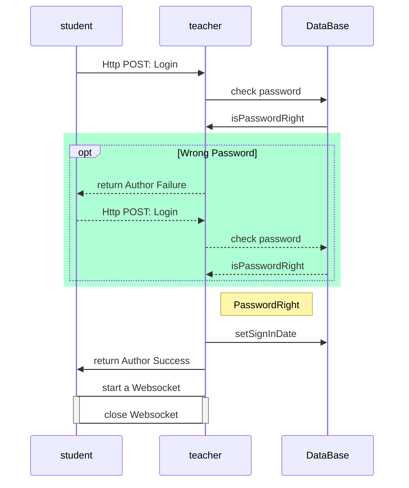

# architecture design

教师机与学生机之间的通信采用C/S、B/S并用方式

在教师机上运行一个Http Server，用以简化教师机与学生机之间的通信过程。

大部分情况下使用Http协议进行沟通。在需要长连接时采用WebSocket协议。

教师机Http Server运行端口号及WebSocket沟通端口号均为`1472`


## 接口及过程设计

### 层次一

* 时序图




* 学生：登录

  `POST			/student/{studentId}`

  ```json
  {
      "student_password": "(string)",
  }
  ```

  return module:

  string: Authorization Accept / Authorization Failure


  if Accept:	start a webSocket `GET		/student/{studentId}/keepAlive`  and set `SignInDate`

* 学生：登出

  断开 webSocket and set `SignOutDate`


* 教师：导入信息

  `func ImportClassInfo()   { }`

  导入结构：

  ```go
  type ClassInfo struct{
      // as the primery key
      ClassName string
      ClassStartDate int64
      ClassOverDate int64
      Students []StudentInfo
  }
  
  type StudentInfo struct{
      StudentId string
      StudentName string
      StudentPassword string
  }
  ```

  转化为数据库中的结构：

  ```go
  type StudentStatus{
      className string
      ClassStartDate int64
      ClassOverDate int64
      StudentId string
      StudentName string
      StudentPassword string
      
      // as unixtimestamp
      SignInDate int64
      SignOutDate int64
      
      // constant package define SignStatus associated with numbers, and it must be caculate by Sign in/out time
      // four statuses are 正常/迟到/早退/缺勤
      SignStatus int
      
      
      // homework status
      
  }
  
  type Homework struct{
      HomeworkTitle string
      // define HomeworkType associated with numbers
      HomeworkType int
      HomeworkAnswer string
      
  }
  ```

* 更改签到状态

  `func  ChangeStudentSignStatus(studentId, className, classStartDate, targetSignStatus) (bool, error) {}`

---------

​    

